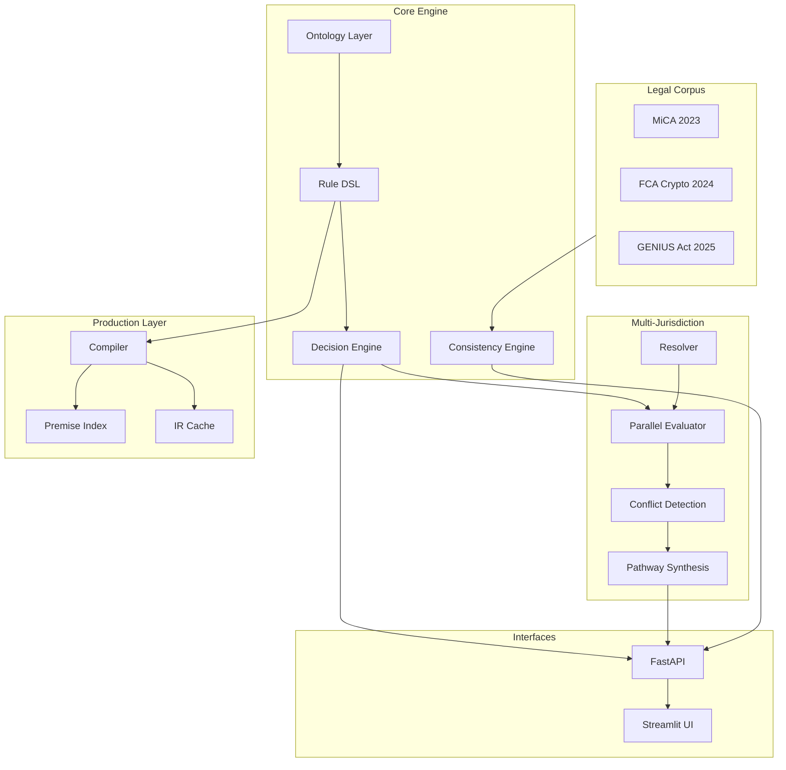

# Regulatory Knowledge Engineering Workbench

A computational law platform for MiCA, RWA tokenization, and stablecoin frameworks. Transforms regulatory documents into executable rules with traceable decision logic.

**Live Demo:** [pazooki.streamlit.app](https://pazooki.streamlit.app)

## Architecture



## Project Structure

```
backend/
├── ontology/       # Domain types (Actor, Instrument, Provision)
├── rules/          # YAML rules + decision engine
├── jurisdiction/   # Multi-jurisdiction (EU, UK, US)
├── compiler/       # YAML → IR compilation
├── verify/         # Semantic consistency engine
└── api/            # FastAPI routes

frontend/
├── Home.py         # Landing page
└── pages/          # KE Workbench, Production Demo, Navigator

data/legal/         # Legal corpus (MiCA, FCA, GENIUS Act)
docs/               # Design documentation
```

## Regulatory Frameworks

| Framework | Jurisdiction | Status |
|-----------|--------------|--------|
| MiCA | EU | Modeled (9 rules) |
| FCA Crypto | UK | Modeled (5 rules) |
| GENIUS Act | US | Illustrative (6 rules) |
| RWA Tokenization | EU | Illustrative (2 rules) |

## Documentation

- [Knowledge Model](docs/knowledge_model.md) — Ontology design
- [Rule DSL](docs/rule_dsl.md) — YAML rule specification
- [Engine Design](docs/engine_design.md) — Architecture details

## Disclaimer

Research/demo project, not legal advice. Rules are interpretive models—consult qualified legal counsel for compliance decisions.

## License

MIT License. See [LICENSE](LICENSE).

---

Built with [Claude Code](https://claude.ai/code)
