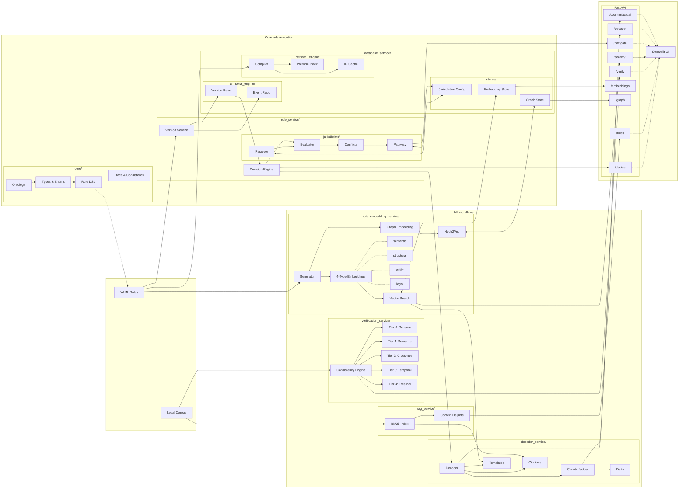

# Regulatory Knowledge Engineering Workbench

A computational law platform for MiCA, RWA tokenization, and stablecoin frameworks. Transforms regulatory documents into executable rules with traceable decision logic.

**Live Demo:** [pazooki.streamlit.app](https://pazooki.streamlit.app)

## Architecture



## Project Structure

```
backend/
├── core/                        # Shared infrastructure
│   ├── config.py                # Settings & feature flags
│   ├── database.py              # SQLModel ORM utilities
│   ├── models.py                # SQLModel entities (RuleRecord, VersionRecord, etc.)
│   ├── ontology/                # Domain types (Actor, Instrument, Provision)
│   ├── visualization/           # Tree rendering (Graphviz, Mermaid)
│   └── api/                     # FastAPI routers
│       ├── routes_decide.py     # /decide endpoint
│       ├── routes_decoder.py    # /decoder endpoint (explanations)
│       ├── routes_counterfactual.py  # /counterfactual endpoint
│       ├── routes_analytics.py  # /analytics endpoint
│       ├── routes_navigate.py   # Cross-border navigation
│       └── routes_ke.py         # KE workbench endpoints
│
├── rule_service/                # Rule management & evaluation
│   ├── data/                    # YAML rule packs (MiCA, FCA, GENIUS)
│   └── app/services/
│       ├── loader.py            # YAML parsing
│       ├── engine.py            # Decision engine with tracing
│       └── jurisdiction/        # Multi-jurisdiction support
│           ├── resolver.py      # Jurisdiction resolution
│           ├── evaluator.py     # Per-jurisdiction evaluation
│           ├── conflicts.py     # Cross-border conflict detection
│           └── pathway.py       # Compliance pathway synthesis
│
├── decoder_service/             # ML-powered explanation layer
│   └── app/services/
│       ├── schemas.py           # ExplanationTier, ScenarioType, Citation
│       ├── decoder.py           # DecoderService (tiered explanations)
│       ├── counterfactual.py    # CounterfactualEngine (what-if analysis)
│       ├── citations.py         # CitationInjector (legal references)
│       ├── templates.py         # TemplateRegistry (explanation templates)
│       └── delta.py             # DeltaAnalyzer (baseline vs counterfactual)
│
├── database_service/            # Persistence & compilation
│   └── app/services/
│       ├── retrieval_engine/
│       │   ├── compiler/        # YAML → IR compilation
│       │   └── runtime/         # IR cache & execution
│       ├── temporal_engine/     # Event sourcing & versioning
│       │   ├── version_repo.py  # Rule version history
│       │   └── event_repo.py    # Audit trail events
│       └── stores/              # Embedding & graph storage
│           ├── embedding_store.py  # Vector storage (5 types)
│           ├── graph_store.py      # Relationship graph
│           └── schemas.py          # Store data models
│
├── verification_service/        # Semantic consistency
│   └── app/services/            # Tier 0-4 consistency checks
│
├── analytics_service/           # Error patterns & drift
│   └── app/services/
│       ├── error_patterns.py    # Pattern analysis
│       ├── drift.py             # Drift detection
│       └── rule_analytics.py    # Clustering & similarity
│
├── rag_service/                 # Retrieval-augmented context
│   └── app/services/            # BM25 index, context helpers
│
└── rule_embedding_service/      # Vector embeddings & graph
    └── app/services/
        ├── embedding_service.py # 4-type embedding generation
        └── graph.py             # Node2Vec graph embeddings

frontend/
├── Home.py                      # Landing page
├── pages/
│   ├── 1_KE_Workbench.py        # Rule verification & review
│   ├── 2_Production_Demo.py     # IR compilation & benchmarks
│   ├── 3_Navigator.py           # Cross-border compliance
│   ├── 4_Embedding_Explorer.py  # UMAP visualization
│   ├── 5_Similarity_Search.py   # Multi-type similarity search
│   ├── 6_Graph_Visualizer.py    # Rule network graphs
│   └── 7_Analytics_Dashboard.py # Clustering & coverage analysis
├── ui/                          # Shared UI components
│   ├── embedding_viz.py         # UMAP rendering
│   ├── graph_components.py      # Graph visualization
│   └── similarity_cards.py      # Search result cards
└── helpers/
    └── analytics_client.py      # Analytics API client

data/legal/                      # Legal corpus (MiCA, FCA, GENIUS Act)
docs/                            # Design documentation
tests/                           # Test suite (28 modules)
```

## Regulatory Frameworks

| Framework | Jurisdiction | Status |
|-----------|--------------|--------|
| MiCA | EU | Modeled (9 rules) |
| FCA Crypto | UK | Modeled (5 rules) |
| GENIUS Act | US | Illustrative (6 rules) |
| RWA Tokenization | EU | Illustrative (2 rules) |

## Rule Embeddings

The system generates 4 types of vector embeddings per rule for multi-faceted similarity search:

| Type | Source | Use Case |
|------|--------|----------|
| **Semantic** | Name, description, decision explanation | Natural language search |
| **Structural** | Conditions, operators, decision logic | Find structurally similar rules |
| **Entity** | Field names, operators | Find rules using same data fields |
| **Legal** | Citations, document IDs | Find rules from same legal sources |

- Uses `sentence-transformers` (all-MiniLM-L6-v2) for dense embeddings
- Falls back to hash-based vectors when ML unavailable
- SQLite: JSON arrays; PostgreSQL: pgvector ready

## Documentation

- [Knowledge Model](docs/knowledge_model.md) — Ontology design
- [Rule DSL](docs/rule_dsl.md) — YAML rule specification
- [Engine Design](docs/engine_design.md) — Architecture details
- [Embedding Service](docs/embedding_service.md) — Vector search design

## Disclaimer

Research/demo project, not legal advice. Rules are interpretive models—consult qualified legal counsel for compliance decisions.

## License

MIT License. See [LICENSE](LICENSE).

---

Built with [Claude Code](https://claude.ai/code)
