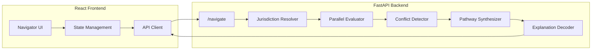

# Compliance Navigator Pro

> Cross-border regulatory compliance, simplified.

Multi-jurisdiction compliance analysis in seconds, not weeks. Built for compliance officers, legal counsel, and fintech product teams navigating tokenized asset regulations across EU, UK, US, Switzerland, and Singapore.

---

## Architecture



---

## Core Capabilities

| Capability | Description |
|------------|-------------|
| **Multi-Jurisdiction Resolution** | Identify applicable regimes from issuer home + target markets |
| **Parallel Evaluation** | Async evaluation of all jurisdictions simultaneously |
| **Conflict Detection** | Identify cross-border contradictions (blocking/warning/info) |
| **Pathway Synthesis** | Ordered compliance steps with dependencies and timelines |
| **What-If Analysis** | Counterfactual scenarios (jurisdiction, entity, threshold, temporal) |
| **Tiered Explanations** | Retail (plain), Protocol (technical), Institutional, Regulator |

---

## TypeScript Types

### Enums

```typescript
enum JurisdictionCode {
  EU = "EU",
  UK = "UK",
  US = "US",
  CH = "CH",
  SG = "SG"
}

enum JurisdictionRole {
  ISSUER_HOME = "issuer_home",
  TARGET = "target",
  PASSPORTING = "passporting"
}

enum ConflictType {
  CLASSIFICATION = "classification_divergence",
  OBLIGATION = "obligation_conflict",
  TIMELINE = "timeline_conflict",
  DECISION = "decision_conflict"
}

enum ConflictSeverity {
  BLOCKING = "blocking",
  WARNING = "warning",
  INFO = "info"
}

enum ExplanationTier {
  RETAIL = "retail",
  PROTOCOL = "protocol",
  INSTITUTIONAL = "institutional",
  REGULATOR = "regulator"
}

enum ScenarioType {
  JURISDICTION_CHANGE = "jurisdiction_change",
  ENTITY_CHANGE = "entity_change",
  ACTIVITY_RESTRUCTURE = "activity_restructure",
  THRESHOLD = "threshold",
  TEMPORAL = "temporal",
  PROTOCOL_CHANGE = "protocol_change",
  REGULATORY_CHANGE = "regulatory_change"
}
```

### Navigate API Types

```typescript
interface NavigateRequest {
  issuer_jurisdiction: JurisdictionCode;
  target_jurisdictions: JurisdictionCode[];
  instrument_type: string;
  activity: string;
  investor_types: string[];
  facts: Record<string, unknown>;
}

interface JurisdictionRoleResponse {
  jurisdiction: JurisdictionCode;
  regime_id: string;
  role: JurisdictionRole;
}

interface JurisdictionResult {
  jurisdiction: JurisdictionCode;
  regime_id: string;
  role: JurisdictionRole;
  applicable_rules: number;
  rules_evaluated: number;
  status: "compliant" | "blocked" | "requires_action" | "no_applicable_rules";
  decisions: Decision[];
  obligations: Obligation[];
}

interface Decision {
  rule_id: string;
  decision: string;
  trace: TraceStep[];
  source: SourceReference;
}

interface Obligation {
  id: string;
  description: string;
  deadline?: string;
  rule_id: string;
  jurisdiction: JurisdictionCode;
}

interface RuleConflict {
  id: string;
  type: ConflictType;
  severity: ConflictSeverity;
  jurisdictions: JurisdictionCode[];
  description: string;
  resolution_strategy: "cumulative" | "stricter" | "home_jurisdiction";
  resolution_note?: string;
  obligations?: string[];
}

interface PathwayStep {
  step_id: string;
  jurisdiction: JurisdictionCode;
  regime_id: string;
  obligation_id: string;
  action: string;
  source: SourceReference;
  prerequisites: string[];
  timeline: { min_days: number; max_days: number };
  status: "pending" | "waived" | "completed";
  waiver_reason?: string;
}

interface NavigateResponse {
  status: "actionable" | "blocked" | "requires_review";
  applicable_jurisdictions: JurisdictionRoleResponse[];
  jurisdiction_results: JurisdictionResult[];
  conflicts: RuleConflict[];
  pathway: PathwayStep[];
  cumulative_obligations: Obligation[];
  estimated_timeline: string;
  audit_trail: AuditEntry[];
}
```

### Decoder Types

```typescript
interface Citation {
  id: string;
  framework: string;
  reference: string;
  full_reference: string;
  text: string;
  url?: string;
  relevance: "primary" | "supporting" | "contextual";
  relevance_score: number;
}

interface Explanation {
  headline: string;
  body: string;
  conditions: string[];
  warnings: string[];
}

interface DecoderResponse {
  explanation_id: string;
  decision_id: string;
  tier: ExplanationTier;
  generated_at: string;
  summary: {
    status: string;
    confidence: number;
    primary_framework: string;
    risk_level: "LOW" | "MEDIUM" | "HIGH" | "CRITICAL";
  };
  explanation: Explanation;
  citations: Citation[];
}
```

### Counterfactual Types

```typescript
interface Scenario {
  type: ScenarioType;
  name?: string;
  parameters: Record<string, unknown>;
}

interface OutcomeSummary {
  status: string;
  framework: string;
  risk_level: "LOW" | "MEDIUM" | "HIGH" | "CRITICAL";
  conditions: string[];
}

interface DeltaAnalysis {
  status_changed: boolean;
  status_from: string;
  status_to: string;
  framework_changed: boolean;
  risk_delta: number; // -2 to +2
  new_requirements: string[];
  removed_requirements: string[];
}

interface CounterfactualResponse {
  counterfactual_id: string;
  baseline_decision_id: string;
  scenario_applied: Scenario;
  baseline_outcome: OutcomeSummary;
  counterfactual_outcome: OutcomeSummary;
  delta: DeltaAnalysis;
  explanation?: {
    summary: string;
    key_differences: Array<{ type: string; description: string }>;
  };
  citations: Citation[];
}
```

### Supporting Types

```typescript
interface TraceStep {
  path: string;
  condition: string;
  result: boolean;
  explanation?: string;
}

interface SourceReference {
  document_id: string;
  article?: string;
  paragraph?: string;
  url?: string;
}

interface AuditEntry {
  timestamp: string;
  action: string;
  details: Record<string, unknown>;
}
```

---

## Frontend Architecture

```
frontend-navigator/
├── src/
│   ├── api/
│   │   ├── client.ts           # Axios/fetch wrapper
│   │   ├── navigate.ts         # POST /navigate
│   │   ├── decoder.ts          # POST /decoder/explain
│   │   └── counterfactual.ts   # POST /counterfactual/analyze
│   │
│   ├── types/
│   │   ├── navigate.ts         # NavigateRequest/Response
│   │   ├── decoder.ts          # DecoderRequest/Response
│   │   ├── counterfactual.ts   # Scenario, Delta, etc.
│   │   └── shared.ts           # Enums, common types
│   │
│   ├── components/
│   │   ├── Navigator/
│   │   │   ├── InputForm.tsx       # Issuer/target/instrument form
│   │   │   ├── JurisdictionCard.tsx # Per-jurisdiction result
│   │   │   ├── ConflictBadge.tsx   # Conflict severity display
│   │   │   ├── PathwayTimeline.tsx # Step-by-step roadmap
│   │   │   └── ObligationList.tsx  # Cumulative obligations
│   │   │
│   │   ├── WhatIf/
│   │   │   ├── ScenarioBuilder.tsx # Scenario type selector
│   │   │   ├── DeltaView.tsx       # Before/after comparison
│   │   │   └── ComparisonMatrix.tsx # Multi-scenario table
│   │   │
│   │   └── Decoder/
│   │       ├── TierSelector.tsx    # Retail/Protocol/etc.
│   │       ├── ExplanationCard.tsx # Tiered explanation
│   │       └── CitationList.tsx    # Legal references
│   │
│   ├── hooks/
│   │   ├── useNavigate.ts      # React Query for /navigate
│   │   ├── useCounterfactual.ts
│   │   └── useDecoder.ts
│   │
│   └── pages/
│       ├── NavigatorPage.tsx   # Main navigator view
│       ├── WhatIfPage.tsx      # Counterfactual analysis
│       └── ReportPage.tsx      # Export/download view
```

---

## Backend Implementation

### Jurisdiction Module

| File | Purpose |
|------|---------|
| `resolver.py` | Maps issuer+targets to applicable jurisdictions with regime IDs |
| `evaluator.py` | Async parallel evaluation of facts against rules per jurisdiction |
| `conflicts.py` | Detects DECISION, OBLIGATION, CLASSIFICATION, TIMELINE conflicts |
| `pathway.py` | Synthesizes ordered steps with dependencies and timeline estimates |

### Key Functions

```python
# Resolution
resolve_jurisdictions(issuer, targets, instrument_type) -> list[ApplicableJurisdiction]
get_equivalences(from_jurisdiction, to_jurisdictions) -> list[EquivalenceDetermination]

# Evaluation (async)
evaluate_jurisdiction(jurisdiction, regime_id, facts) -> JurisdictionResult
evaluate_multiple_jurisdictions(jurisdictions, facts) -> list[JurisdictionResult]

# Conflicts
detect_conflicts(jurisdiction_results) -> list[RuleConflict]

# Pathway
synthesize_pathway(results, conflicts, equivalences) -> list[PathwayStep]
aggregate_obligations(results) -> list[Obligation]
estimate_timeline(pathway) -> str  # "1-3 months", etc.
```

### Conflict Detection Logic

| Conflict Type | Trigger | Resolution |
|---------------|---------|------------|
| DECISION_CONFLICT | Compliant in A, blocked in B | Apply stricter |
| OBLIGATION_CONFLICT | Mutually exclusive requirements | Cumulative |
| CLASSIFICATION_DIVERGENCE | Different regulatory treatment | Satisfy both |
| TIMELINE_CONFLICT | Different deadlines | Use earliest |

---

## API Endpoints

| Endpoint | Method | Description |
|----------|--------|-------------|
| `/navigate` | POST | Main cross-border analysis |
| `/navigate/jurisdictions` | GET | List supported jurisdictions |
| `/navigate/regimes` | GET | List regulatory regimes |
| `/navigate/equivalences` | GET | List equivalence determinations |
| `/decoder/explain` | POST | Generate tiered explanation |
| `/counterfactual/analyze` | POST | Single what-if scenario |
| `/counterfactual/compare` | POST | Multi-scenario comparison |

---

## Supported Jurisdictions

| Code | Name | Authority | Framework |
|------|------|-----------|-----------|
| EU | European Union | ESMA | MiCA 2023 |
| UK | United Kingdom | FCA | FCA Crypto 2024 |
| US | United States | SEC | Securities Act 1933 |
| CH | Switzerland | FINMA | FINSA/DLT 2021 |
| SG | Singapore | MAS | PSA 2019 |

---

## What-If Scenarios

| Scenario Type | Parameters | Use Case |
|---------------|------------|----------|
| JURISDICTION_CHANGE | `to_jurisdiction` | What if we target UK instead of EU? |
| ENTITY_CHANGE | `to_entity_type` | What if retail vs institutional? |
| THRESHOLD | `threshold_type`, `new_value` | What if amount > EUR 5M? |
| TEMPORAL | `effective_date` | What if after MiCA phase-in? |
| ACTIVITY_RESTRUCTURE | `new_activity` | What if custody vs trading? |

---

## Example: Swiss Stablecoin Issuer Targeting EU/UK

### Request

```json
{
  "issuer_jurisdiction": "CH",
  "target_jurisdictions": ["EU", "UK"],
  "instrument_type": "stablecoin",
  "activity": "public_offer",
  "investor_types": ["professional"]
}
```

### Response Summary

| Metric | Value |
|--------|-------|
| Jurisdictions | 3 (CH home, EU target, UK target) |
| Conflicts | 1 (FCA cooling-off vs MiCA immediate execution) |
| Pathway Steps | 5 steps with dependencies |
| Estimated Timeline | 3-6 months |

### Compliance Pathway

1. **Maintain CH authorization** (FINMA) - issuer_home jurisdiction
2. **Submit whitepaper** (MiCA Art. 6) - 1-20 days
3. **Obtain EU authorization** (MiCA Art. 21) - 90-180 days, depends on step 2
4. **Obtain FCA authorization** (UK) - 90-180 days, parallel with step 3
5. **Implement UK cooling-off** (FCA) - 5-30 days, after step 4

---

## Platform Dependencies

The Navigator Pro module integrates with the broader computational law platform:

| Component | Integration |
|-----------|-------------|
| **Rule Engine** | Decision evaluation with tracing |
| **RAG Service** | Citation retrieval for explanations |
| **Embedding Store** | Template selection via similarity |
| **Premise Index** | O(1) rule lookup for performance |

---

## Deployment

Navigator Pro is deployed separately from the KE Workbench, consuming a shared backend API:

```
┌─────────────────────────────────────────────────────────────────┐
│                      Shared FastAPI Backend                      │
│                         (Railway)                                │
└─────────────────────────────────────────────────────────────────┘
          │                                    │
          ▼                                    ▼
┌─────────────────────┐            ┌─────────────────────┐
│   KE Workbench      │            │ Navigator Pro       │
│   (Streamlit Cloud) │            │ (Vercel)            │
└─────────────────────┘            └─────────────────────┘
```

| Service | Platform | URL |
|---------|----------|-----|
| FastAPI Backend | Railway | `api.droit.railway.app` |
| KE Workbench | Streamlit Cloud | `pazooki.streamlit.app` |
| Navigator Pro | Vercel | `navigator-pro.vercel.app` |

The React frontend consumes the shared backend via CORS-enabled REST API. Environment variable `CORS_ORIGINS` controls allowed frontend origins.

---

## Disclaimer

Research/demo project, not legal advice. Rules are interpretive models. Consult qualified legal counsel for compliance decisions.

---

Built with [Claude Code](https://claude.ai/code)
